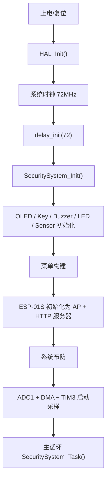

# 基于声音与振动的家庭安防预警系统项目介绍

## 1. 项目概述

这是一个基于 `STM32F103C8` 的家庭安防预警系统，核心思路是同时采集两类入侵信号：

- `MAX4466` 采集环境声音，识别撞击、敲击、异响等音频特征
- `PZT` 压电振动传感器采集门窗、墙体等结构振动特征

系统不是单纯地“有声音就报警”，而是采用“特征提取 + 阈值分类 + 双模态融合”的方式降低误报：

- 声音通道会提取能量、RMS、频域能量分布、主频
- 振动通道会提取峰值、能量、零交叉率、主频
- 只有当音频和振动在时间窗口内同时达到中等强度，或者振动强度非常高时，才会触发报警

同时系统还集成了：

- `OLED` 本地显示
- 按键菜单参数配置
- 蜂鸣器报警
- `ESP-01S` Wi-Fi 热点和网页控制

工程入口很短，真正的业务逻辑集中在 `Drivers/APPLICATION/Menu/Menu.c`，主循环只负责不断执行系统任务。

---

## 2. 工程运行平台

- MCU：`STM32F103C8`
- 工程类型：Keil MDK 工程
- 启动文件：`startup_stm32f101xb.s`
- 系统时钟：HSE + PLL，配置为 72MHz
- 代码风格：HAL 库 + 自定义驱动 + 菜单框架

主入口在 `Users/main.c`：

```c
HAL_Init();
sys_stm32_clock_init(RCC_PLL_MUL9);
delay_init(72);
SecuritySystem_Init();
while (1)
{
    SecuritySystem_Task();
}
```

这说明程序是一个典型的“裸机超级循环”结构，没有 RTOS。

---

## 3. 模块职责总览

| 模块 | 作用 |
|---|---|
| `Users/main.c` | 程序入口，只做系统初始化并进入主任务循环 |
| `Drivers/SYSTEM/sys/sys.c` | 系统时钟、NVIC、待机、软复位等底层支持 |
| `Drivers/SYSTEM/delay/delay.c` | 自定义延时，覆盖 HAL_Delay |
| `Drivers/Hardware/MAX4466/MAX4466.c` | 声音信号采样特征提取与 FFT 分析 |
| `Drivers/Hardware/PZT_Sensor/PZT_Sensor.c` | 振动信号采样特征提取与 FFT 分析 |
| `Drivers/Hardware/ESP_01S/ESP_01S.c` | ESP8266 AT 指令驱动、热点、HTTP 服务 |
| `Drivers/Hardware/OLED/OLED.c` | 128x64 OLED 显示驱动与图形绘制 |
| `Drivers/Hardware/KEY/KEY.c` | 按键扫描、消抖、事件队列 |
| `Drivers/Hardware/Buzzer/Buzzer.c` | 蜂鸣器控制 |
| `Drivers/APPLICATION/Menu/MenuFramework.c` | 通用菜单框架 |
| `Drivers/APPLICATION/Menu/Menu.c` | 安防系统状态机、融合判定、网页接口、菜单绑定 |
| `Users/stm32f1xx_it.c` | 中断入口：TIM2、DMA、USART1、SysTick |

---

## 4. 硬件连接与引脚

### 4.1 传感器与执行器

| 器件 | 引脚 | 外设 | 说明 |
|---|---|---|---|
| `MAX4466` 音频模拟输出 | `PA0` | `ADC1_CHANNEL0` | 音频采样输入 |
| `PZT` 振动传感器模拟输出 | `PA1` | `ADC1_CHANNEL1` | 振动采样输入 |
| 蜂鸣器 | `PB11` | GPIO 输出 | 低电平有效 |
| 按键上 | `PB12` | GPIO 输入上拉 | 低电平表示按下 |
| 按键下 | `PB13` | GPIO 输入上拉 | 低电平表示按下 |
| 按键确认 | `PB14` | GPIO 输入上拉 | 低电平表示按下 |
| 按键返回 | `PB15` | GPIO 输入上拉 | 低电平表示按下 |
| OLED I2C SCL | `PB6` | `I2C1_SCL` | 硬件 I2C 模式 |
| OLED I2C SDA | `PB7` | `I2C1_SDA` | 硬件 I2C 模式 |
| ESP-01S RX | `PA10` | `USART1_RX` | STM32 接收 ESP 数据 |
| ESP-01S TX | `PA9` | `USART1_TX` | STM32 发送 AT 指令 |
| 状态 LED | `PA6` | GPIO 输出 | 低电平点亮 |

### 4.2 关键电气特性

- 蜂鸣器、状态灯、按键均采用低电平有效逻辑
- 按键使用上拉输入，因此按下后读到 `0`
- OLED 采用硬件 I2C，默认 400kHz
- ESP-01S 采用串口 AT 协议，默认波特率 115200，失败时会尝试 9600 兜底

---

## 5. 关键数据结构与参数

### 5.1 安防状态枚举

`SecuritySystem_State_t` 包含 5 个状态：

| 状态 | 含义 |
|---|---|
| `SECURITY_STATE_DISARMED` | 撤防状态，不报警 |
| `SECURITY_STATE_WARMUP` | 布防后预热阶段，约 3 秒 |
| `SECURITY_STATE_ARMED` | 正常布防监测状态 |
| `SECURITY_STATE_SUSPICIOUS` | 可疑状态，表示检测到中等强度事件 |
| `SECURITY_STATE_ALARM_LATCHED` | 报警锁存状态 |

### 5.2 系统状态结构

`SecuritySystem_Status_t` 是整套系统的运行快照，字段含义如下：

| 字段 | 含义 |
|---|---|
| `armed` | 是否布防，`1` 表示启用监测 |
| `silenced` | 是否静音，只影响蜂鸣器，不影响 LED |
| `wifi_ready` | ESP-01S 是否成功初始化并提供热点/服务器 |
| `active_clients` | 当前连接到热点的客户端数量 |
| `state` | 当前状态机状态 |
| `last_alarm_tick` | 上一次触发报警的系统时间，单位 ms |
| `last_alarm_reason` | 最近一次报警原因，如 `VIB_STRONG`、`AUDIO_VIB` |
| `audio_features` | 音频通道特征，见下文 |
| `vibration_features` | 振动通道特征，见下文 |
| `audio_baseline_energy` | 音频基线能量，用于自适应阈值 |
| `vibration_baseline_peak_mv` | 振动基线峰值 |
| `vibration_baseline_energy` | 振动基线能量 |
| `alarm_hold_ms` | 报警保持时间 |
| `fusion_window_ms` | 音频和振动事件融合的时间窗口 |
| `audio_medium_ratio_pct` | 音频中等事件的频带比例阈值 |
| `audio_strong_ratio_pct` | 音频强事件的频带比例阈值 |

### 5.3 音频特征结构

`MAX4466_Feature_t` 的含义：

| 字段 | 含义 |
|---|---|
| `raw_mean` | 原始 ADC 均值 |
| `raw_min` | 帧内最小 ADC 值 |
| `raw_max` | 帧内最大 ADC 值 |
| `voltage_mean_mv` | 原始均值换算后的毫伏值 |
| `rms` | 去直流后的交流 RMS |
| `peak_to_peak` | 峰峰值，单位 mV |
| `band_energy_low` | 低频带能量 |
| `band_energy_mid` | 中频带能量 |
| `band_energy_high` | 高频带能量 |
| `total_energy` | 有效频带总能量 |
| `band_ratio_pct` | 中高频能量占比，百分比 |
| `dominant_freq_hz` | 主频，Hz |

### 5.4 振动特征结构

`PZT_Sensor_Feature_t` 的含义：

| 字段 | 含义 |
|---|---|
| `raw_mean` | 原始 ADC 均值 |
| `pa1_mean_mv` | PA1 引脚电压均值，mV |
| `sensor_mean_mv` | 传感器侧折算电压均值，mV |
| `peak_mv` | 去直流后的绝对峰值，mV |
| `energy` | 时间域均方能量 |
| `zero_cross_permille` | 零交叉密度，千分比 |
| `dominant_freq_hz` | 主频，Hz |

### 5.5 ESP 数据结构

`ESP_DataPacket_t`：

| 字段 | 含义 |
|---|---|
| `data` | 接收到的原始数据内容 |
| `len` | 数据长度 |
| `link_id` | 连接 ID，通常是 0~4 |

`ESP_Status_t`：

| 枚举值 | 含义 |
|---|---|
| `ESP_OK` | 成功 |
| `ESP_ERR_TIMEOUT` | 超时 |
| `ESP_ERR_AT_FAIL` | AT 返回失败 |
| `ESP_ERR_SEND_FAIL` | 发送失败 |
| `ESP_ERR_BUSY` | 忙状态 |

---

## 6. 关键编译期参数说明

### 6.1 采样与帧长

| 参数 | 值 | 作用 |
|---|---|---|
| `MAX4466_SAMPLE_RATE_HZ` | `4000` | 音频采样率 |
| `MAX4466_FRAME_SAMPLES` | `128` | 音频单帧采样点数 |
| `PZT_SAMPLE_RATE_HZ` | `4000` | 振动采样率 |
| `PZT_FRAME_SAMPLES` | `128` | 振动单帧采样点数 |
| `SECURITY_ADC_CHANNEL_COUNT` | `2` | ADC 扫描通道数 |
| `SECURITY_DMA_FRAME_WORDS` | `256` | 一帧 DMA 半缓冲字数 |
| `SECURITY_DMA_BUFFER_WORDS` | `512` | DMA 环形缓冲总字数 |

因为是 4kHz 采样、128 点 FFT，所以频率分辨率为：

`4000 / 128 = 31.25 Hz / bin`

这意味着每个频点约代表 31.25Hz 的频率间隔。

### 6.2 预设时序参数

| 参数 | 值 | 作用 |
|---|---|---|
| `SECURITY_WARMUP_MS` | `3000` | 布防后预热时间 |
| `SECURITY_MENU_REFRESH_MS` | `200` | 菜单/OLED 刷新节流 |
| `SECURITY_ESP_RETRY_MS` | `5000` | ESP 初始化失败后的重试间隔 |
| `SECURITY_SUSPICIOUS_BLINK_MS` | `500` | 可疑状态 LED 闪烁周期 |
| `SECURITY_ALARM_BLINK_MS` | `125` | 报警状态 LED 闪烁周期 |

### 6.3 经验阈值

| 参数 | 值 | 作用 |
|---|---|---|
| `SECURITY_AUDIO_ENERGY_FLOOR` | `1500` | 音频能量阈值下限 |
| `SECURITY_VIBRATION_ENERGY_FLOOR` | `200` | 振动中等能量阈值下限 |
| `SECURITY_VIBRATION_STRONG_ENERGY_FLOOR` | `800` | 振动强事件能量阈值下限 |

这些“下限”是为了在环境非常安静、基线很低时，仍然避免阈值过低导致误报。

### 6.4 可调菜单参数

初始化时，系统给这些参数设置了默认值，并允许在 OLED 菜单里动态修改：

| 菜单项 | 默认值 | 范围 | 步进 | 作用 |
|---|---:|---:|---:|---|
| `Hold ms` | `15000` | `3000~60000` | `1000` | 报警锁存持续时间 |
| `Fusion ms` | `300` | `100~1000` | `50` | 音频/振动融合时间窗口 |
| `Audio mid%` | `40` | `20~90` | `5` | 中等音频事件的频带占比阈值 |
| `Audio hi%` | `55` | `30~95` | `5` | 强音频事件的频带占比阈值 |

这些参数会直接影响误报率和灵敏度：

- `Hold ms` 越大，报警保持越久
- `Fusion ms` 越大，越容易把两种事件合并为一次报警
- `Audio mid%` 和 `Audio hi%` 越大，越偏向识别“高频、突发、非低频噪声”的声音

### 6.5 Wi-Fi 参数

| 参数 | 值 | 作用 |
|---|---|---|
| `ESP_WIFI_SSID` | `ESP8266_AP` | 热点名称 |
| `ESP_WIFI_PASS` | `12345678` | 热点密码 |
| `ESP_AP_IP` | `192.168.4.1` | 热点地址 |
| `ESP_SERVER_PORT` | `5000` | HTTP 服务端口 |
| `ESP_UART_BAUD` | `115200` | 默认串口波特率 |
| `ESP_RX_BUF_SIZE` | `768` | 串口接收环形缓冲区 |
| `ESP_TX_BUF_SIZE` | `1400` | 发送缓冲区 |
| `ESP_DATA_BUF_SIZE` | `384` | 单个 HTTP 数据包最大长度 |
| `ESP_AT_TIMEOUT` | `3000` | AT 指令等待超时 |

### 6.6 OLED 参数

| 参数 | 值 | 作用 |
|---|---|---|
| `OLED_USE_HARDWARE_I2C` | `1` | 使用硬件 I2C |
| `OLED_USE_DMA` | `0` | OLED 不占用 DMA 传输 |
| `OLED_DMA_TRANSPORT_MODE` | `0` | 采用阻塞式 I2C 发送 |
| `OLED_ENABLE_DIFF_UPDATE` | `1` | 只刷新变化区域 |
| `OLED_I2C_ADDR` | `0x78` | OLED I2C 地址 |
| `OLED_I2C_CLOCK_SPEED` | `400000` | I2C 时钟 |
| `OLED_I2C_TIMEOUT` | `100` | I2C 发送超时 |
| `OLED_DMA_WAIT_TIMEOUT` | `20` | DMA 等待超时 |

### 6.7 菜单框架参数

| 参数 | 值 | 作用 |
|---|---|---|
| `MF_MAX_MENUS` | `20` | 最多菜单页数 |
| `MF_MAX_ITEMS_PER_MENU` | `10` | 单页最多条目数 |
| `MF_NAV_STACK_DEPTH` | `8` | 菜单导航栈深度 |
| `MF_DISPLAY_LINES` | `3` | 菜单显示行数 |
| `MF_LINE_HEIGHT` | `16` | 每行像素高度 |
| `MF_TITLE_HEIGHT` | `16` | 标题栏高度 |
| `MF_SCREEN_WIDTH` | `128` | 屏幕宽度 |
| `MF_SCREEN_HEIGHT` | `64` | 屏幕高度 |
| `MF_FONT` | `OLED_8X16` | 默认菜单字体 |
| `MF_FONT_WIDTH` | `8` | 字体单字宽度 |
| `MF_ANIM_SPEED` | `0.3` | 光标动画速度 |
| `MF_CURSOR_PADDING` | `1` | 光标边框内边距 |
| `MF_LINE_BUF_SIZE` | `48` | 菜单渲染临时字符串缓冲区 |

---

## 7. 系统启动流程



### 7.1 时钟

`sys_stm32_clock_init(RCC_PLL_MUL9)` 使用 HSE + PLL，将系统时钟配置为 72MHz。  
`delay_init(72)` 与这个主频一致，用于后续毫秒/微秒延时。

### 7.2 传感器与外设初始化顺序

`SecuritySystem_Init()` 的顺序是：

1. 清空状态结构
2. 初始化 OLED、按键、蜂鸣器、状态灯
3. 初始化音频与振动特征提取模块
4. 构建菜单
5. 初始化 ESP-01S 热点和网页服务
6. 默认布防
7. 初始化 ADC、TIM3、DMA
8. 启动采样

这个顺序是合理的，因为：

- 先把显示、按键等人机交互设备准备好
- 再启动网络服务，便于查看状态
- 最后才打开采样，避免上电瞬间的噪声干扰作为有效样本进入分析流程

---

## 8. 采样与信号处理流程

### 8.1 ADC 采样结构

ADC1 配置为扫描模式，两个通道按顺序采样：

1. `MAX4466` -> `PA0` -> `ADC_CHANNEL_0`
2. `PZT` -> `PA1` -> `ADC_CHANNEL_1`

触发源不是软件轮询，而是 `TIM3 TRGO`：

- `TIM3 Prescaler = 71`
- `TIM3 Period = 249`

在 72MHz 时钟下，这对应 4kHz 触发频率，正好匹配两个传感器的采样率设定。

### 8.2 DMA 缓冲与帧处理

DMA 使用循环模式，缓冲区大小为 `512` 个 halfword。  
其中：

- 前 `256` 个 halfword 作为半缓冲
- 后 `256` 个 halfword 作为全缓冲

每次半传输完成或全传输完成，中断回调只置位标志，不做重运算：

- `HAL_ADC_ConvHalfCpltCallback()` -> 标记半帧可处理
- `HAL_ADC_ConvCpltCallback()` -> 标记全帧可处理

主循环里 `SecuritySystem_ProcessPendingFrames()` 再统一消费这些帧，避免在中断里做大量 FFT 运算。

### 8.3 帧数据拆分

ADC 数据是交织存储的，格式为：

```text
[audio0, vib0, audio1, vib1, audio2, vib2, ...]
```

在 `SecuritySystem_ProcessFrame()` 中会拆成两份：

- `s_audio_frame[]`
- `s_vibration_frame[]`

随后分别调用：

- `MAX4466_AnalyzeFrame()`
- `PZT_Sensor_AnalyzeFrame()`

### 8.4 音频分析

`MAX4466_AnalyzeFrame()` 做了这些事情：

1. 计算原始 ADC 均值
2. 统计最小值和最大值
3. 计算去直流后的交流 RMS
4. 计算峰峰值
5. 对 128 点数据加 Hann 窗
6. 做 128 点 radix-2 FFT
7. 累加低/中/高频段能量
8. 取主频 bin 作为 `dominant_freq_hz`

频带划分是固定的：

- 低频：`bin 4..11`，约 `125..343 Hz`
- 中频：`bin 12..27`，约 `375..843 Hz`
- 高频：`bin 28..57`，约 `875..1781 Hz`

最终还会计算一个很关键的比例：

```text
band_ratio_pct = (mid_energy + high_energy) / total_energy * 100
```

这个比例越高，越说明声音更偏向中高频，通常比低频环境噪声更值得怀疑。

### 8.5 振动分析

`PZT_Sensor_AnalyzeFrame()` 做了这些事情：

1. 求原始 ADC 均值
2. 将 PA1 电压折算为传感器侧电压
3. 去直流后统计峰值
4. 计算时间域均方能量
5. 统计零交叉密度
6. 加 Hann 窗并做 FFT
7. 搜索 `bin 1..25` 中最强频点，得到主频

其中 `PZT_DIVIDER_NUMERATOR = 37`、`PZT_DIVIDER_DENOMINATOR = 27` 用于把 PA1 侧电压折算到传感器侧。  
如果硬件分压比变化，这两个参数也要一起改。

### 8.6 FFT 与窗口

两路分析都使用：

- 128 点 FFT
- Hann 窗
- Q15 预计算旋转因子
- 迭代蝶形

这样做的好处是：

- 适合 MCU 运算
- 运行时不依赖浮点实时计算
- 比简单的阈值触发更能抑制误报

---

## 9. 报警判定逻辑

这是项目最核心的部分，逻辑位于 `SecuritySystem_ClassifyAudio()`、`SecuritySystem_ClassifyVibration()` 和 `SecuritySystem_ProcessDetection()`。

### 9.1 音频判定

音频通道会根据当前基线动态计算阈值：

- `medium_threshold = baseline * 2.5`
- `strong_threshold = baseline * 5`

同时还要求频带比例满足门限：

- 中等音频：`band_ratio_pct >= audio_medium_ratio_pct`
- 强音频：`band_ratio_pct >= audio_strong_ratio_pct`

因此，音频判定不是单看音量，而是“能量 + 频谱形态”双条件。

### 9.2 振动判定

振动通道的判定更严格，除能量和峰值外，还会检查：

- 主频在 `31..800 Hz`
- `zero_cross_permille >= 80`

这样可以排除：

- 缓慢漂移
- 偏置变化
- 直流型扰动
- 低活动度噪声

阈值仍然基于自适应基线：

- 中等峰值门限约为基线的 `1.8` 倍
- 强峰值门限约为基线的 `3` 倍
- 中等能量门限约为基线的 `2` 倍
- 强能量门限约为基线的 `3.5` 倍

同时又加了下限，防止环境过于安静时阈值过低。

### 9.3 事件融合

报警策略分三种：

1. **强振动立即报警**
   - 只要振动判定达到 `SIGNAL_LEVEL_STRONG`
   - 直接触发 `VIB_STRONG`

2. **音频 + 振动窗口融合报警**
   - 当音频与振动都达到中等强度
   - 且二者发生时间间隔小于 `fusion_window_ms`
   - 触发 `AUDIO_VIB`

3. **单通道中等事件**
   - 只进入 `SUSPICIOUS`
   - 不立即报警
   - 等待后续是否出现另一通道联动

### 9.4 状态机转移

| 当前状态 | 条件 | 结果 |
|---|---|---|
| `DISARMED` | 布防打开 | 进入 `WARMUP` |
| `WARMUP` | 经过 `3000 ms` | 进入 `ARMED` |
| `ARMED` | 单路中等事件 | 进入 `SUSPICIOUS` |
| `ARMED` 或 `SUSPICIOUS` | 双通道时间窗融合 | 进入 `ALARM_LATCHED` |
| `ALARM_LATCHED` | 保持时间到期且无后续活动 | 回到 `ARMED` |
| `ALARM_LATCHED` | 保持时间到期但仍有活动 | 回到 `SUSPICIOUS` |
| 任意状态 | 撤防 | 强制进入 `DISARMED` |

### 9.5 状态输出

`SecuritySystem_UpdateOutputs()` 负责把状态机结果映射到实际输出：

- `SUSPICIOUS`：LED 每 500ms 闪烁
- `ALARM_LATCHED`：LED 每 125ms 闪烁
- `ALARM_LATCHED` 且未静音：蜂鸣器跟随 LED 闪烁
- `silenced = 1` 时只关闭蜂鸣器，LED 仍然保留报警闪烁

---

## 10. 用户界面与菜单

### 10.1 菜单框架

`MenuFramework.c` 是一个通用 OLED 菜单框架，支持：

- 子菜单
- 动作项
- 开关项
- 数值项
- 自定义页面

默认光标样式是反色高亮，光标动画速度为 `0.3`。

### 10.2 本项目菜单结构

根菜单 `Security` 下有以下项目：

| 项目 | 类型 | 作用 |
|---|---|---|
| `Status Page` | 动作项 | 进入实时状态页 |
| `Armed` | 开关项 | 布防/撤防切换 |
| `Params` | 子菜单 | 进入参数设置页 |
| `WiFi Page` | 动作项 | 进入 Wi-Fi 信息页 |
| `Silence` | 动作项 | 静音报警蜂鸣器 |
| `Clear Alarm` | 动作项 | 清除报警并恢复状态 |

`Params` 子菜单包含：

| 参数 | 说明 |
|---|---|
| `Hold ms` | 报警保持时长 |
| `Fusion ms` | 音频/振动融合窗口 |
| `Audio mid%` | 音频中等事件阈值 |
| `Audio hi%` | 音频强事件阈值 |

### 10.3 菜单交互

按键的作用是：

- `UP`：上移或增加数值
- `DOWN`：下移或减少数值
- `ENTER`：进入/确认
- `BACK`：返回/取消

在菜单页中，按键会进入 `MF_Process()`。  
在状态页或 Wi-Fi 页中，`BACK` 或 `ENTER` 会返回菜单页。

### 10.4 OLED 页面

系统实际有三种显示页面：

1. 菜单页
2. 实时状态页
3. Wi-Fi 信息页

实时状态页显示：

- 当前状态
- 布防/静音状态
- 音频主频、能量、RMS、频带比例
- 振动主频、峰值、能量、零交叉率
- 最近报警原因

Wi-Fi 页显示：

- SSID
- 密码
- IP
- 端口
- 初始化状态
- 错误阶段
- 当前客户端数
- 当前串口波特率

---

## 11. Wi-Fi 与网页控制

### 11.1 ESP-01S 初始化策略

`ESP_01S.c` 不是直接使用 Socket API，而是通过 AT 指令控制 ESP8266。

初始化流程大致是：

1. 尝试 115200 波特率
2. 如果 `AT` 无响应，则重试 9600
3. 关闭回显 `ATE0`
4. 关闭自动连接
5. 设置热点模式
6. 设置 AP IP 地址
7. 设置 DHCP
8. 设置 SSID 和密码
9. 启动多连接 TCP Server
10. 设置 server 超时

`ESP_GetLastErrorStep()` 会返回失败发生在哪个阶段，便于在 OLED 上查看。

### 11.2 热点配置

热点默认信息：

- SSID：`ESP8266_AP`
- 密码：`12345678`
- IP：`192.168.4.1`
- 端口：`5000`

### 11.3 网络协议

ESP 接收数据时，驱动会解析：

- `+IPD,<link_id>,<len>:<payload>`
- `<id>,CONNECT`
- `<id>,CLOSED`

其中 `link_id` 范围通常为 `0~4`。  
驱动内部用一个位掩码记录当前活跃连接，再通过位数统计得到 `active_clients`。

### 11.4 HTTP 接口

系统内置了一个简单网页，用于手机或电脑直接控制。

根页面提供 4 个按钮：

- `/arm`
- `/disarm`
- `/silence`
- `/clear`

还会以 AJAX 轮询 `/api/status`，页面每秒刷新一次状态。

#### 页面返回的 JSON 字段

```json
{
  "state": "ARMED",
  "armed": 1,
  "silenced": 0,
  "reason": "NONE",
  "last_alarm_tick": 0,
  "audio_freq": 0,
  "audio_energy": 0,
  "audio_ratio": 0,
  "audio_rms": 0,
  "vib_freq": 0,
  "vib_peak": 0,
  "vib_energy": 0,
  "zero_cross": 0,
  "wifi_ready": 1,
  "clients": 1
}
```

这些字段与 OLED 状态页显示的是同一份状态数据。

### 11.5 HTTP 路径处理

`SecuritySystem_HandleHttpPath()` 支持的路径如下：

| 路径 | 作用 |
|---|---|
| `/` | 返回网页首页 |
| `/api/status` | 返回 JSON 状态 |
| `/favicon.ico` | 返回 204 |
| `/arm` | 布防 |
| `/disarm` | 撤防 |
| `/silence` | 静音 |
| `/clear` | 清除报警 |

如果请求不是 `GET`，会返回 `405 Method Not Allowed`。  
如果路径格式不合法，会返回 `400 Bad Request`。

---

## 12. 中断与定时器工作方式

### 12.1 SysTick

`SysTick_Handler()` 只做一件事：

- 调用 `HAL_IncTick()`

系统所有 `HAL_GetTick()` 相关逻辑都依赖这个节拍。

### 12.2 按键定时器

按键扫描使用 `TIM2`，周期 10ms：

- `Prescaler = 7199`
- `Period = 99`

在 72MHz 下，TIM2 的计数频率是 10kHz，所以 100 个计数刚好 10ms。  
`HAL_TIM_PeriodElapsedCallback()` 在 TIM2 到期时调用 `Key_TimerCallback()`。

按键消抖参数：

- `KEY_DEBOUNCE_CNT = 2`

这表示需要连续 2 次稳定采样，也就是约 20ms 才认为按键状态真正变化。

### 12.3 ADC DMA 中断

`DMA1_Channel1_IRQHandler()` -> `SecuritySystem_DMA_IRQHandler()` -> `HAL_DMA_IRQHandler()`  
然后由 HAL 回调函数置位半帧/全帧标志，主循环再处理。

### 12.4 串口中断

`USART1_IRQHandler()` -> `ESP_IRQHandler()`  
接收完成后调用 `HAL_UART_RxCpltCallback()`，再进入 `ESP_RxCallback()` 继续下一字节接收。

---

## 13. 主任务循环的实际职责

`SecuritySystem_Task()` 每次循环依次做：

1. 处理已到达的 ADC 半帧/全帧数据
2. 更新状态机
3. 刷新 LED 和蜂鸣器
4. 如果 Wi-Fi 没准备好，则按 5 秒间隔尝试重连
5. 处理 ESP 串口输入
6. 统计当前客户端数量
7. 处理菜单/状态页/UI

这意味着主循环不是“空转”，而是把所有周期性任务统一调度在一个循环里。

---

## 14. 这个项目的设计特点

### 14.1 不是单纯阈值报警，而是融合判定

项目的核心价值在于：

- 音频和振动两个独立传感器互相验证
- 既看强度，也看频谱结构
- 既看单次突发，也看时间上的联动关系

因此比“声音超过某值就报警”的方案更稳。

### 14.2 具有环境自适应能力

系统使用基线 EMA 进行环境跟踪：

- 首个静态帧作为初始基线
- 后续使用 `alpha = 1/32` 的指数滑动平均更新基线

这样可以在环境长期变化时自动调整，而不是完全依赖固定阈值。

### 14.3 同时具备本地和远程交互

- 本地：OLED + 按键 + 蜂鸣器
- 远程：ESP 热点 + Web UI

你可以在现场直接看屏幕，也可以用手机浏览器连接热点查看实时数据。

---

## 15. 一句话总结

这个项目本质上是一个“基于 STM32 的双模态入侵检测平台”：

- 用 `MAX4466` 识别声音异常
- 用 `PZT` 识别结构振动异常
- 用 FFT 和能量特征做判别
- 用状态机完成布防、预热、可疑、报警、锁存和恢复
- 用 OLED、按键、蜂鸣器和 ESP-01S 网页端构成完整的人机交互闭环

如果你要把它写进论文、答辩或项目说明，这份代码的核心叙述可以概括为：

**“通过音频与振动双通道采集，结合频域特征提取和时间窗融合判定，实现低误报的家庭安防预警。”**

